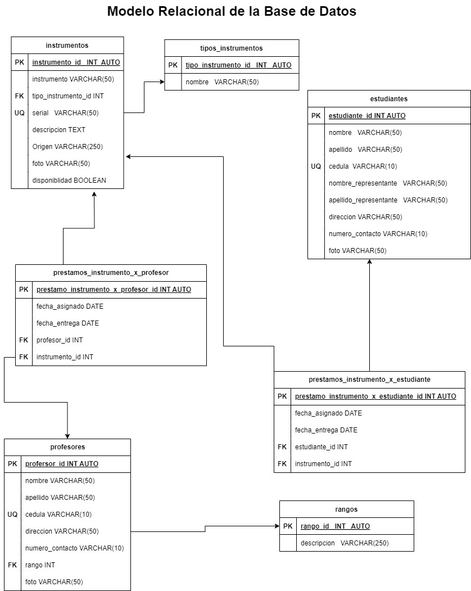

# Sistema de información para el manejo de inventario del Sistema de Orquesta Nacional - Núcleo Chivacoa

## Listado de entidades

### instrumentos **(ED)**

- instrumento_id **(PK)**
- instrumento
- tipo_instrumento_id **(FK)**
- serial **(UQ)**
- descripcion
- origen
- foto
- disponibilidad

### estudiantes **(ED)**

- estudante_id **(PK)**
- nombre
- apellido
- cedula **(UQ)**
- nombre_representante
- apellido_representante
- direccion
- numero_contacto
- foto

### profesores **(ED)**

- profesor_id **(PK)**
- nombre
- apellido
- cedula **(UQ)**
- direccion
- numero_contacto
- rango_id **(FK)**
- foto

### prestamo_instrumentos_x_estudiantes **(ED)**

- prestamo_instrumento_x_estudiante_id **(PK)**
- fecha_asignado
- fecha_entrega
- estudiante_id **(FK)**
- instrumento_id **(FK)**

### prestamo_instrumento_x_profesores **(ED)**

- prestamo_instrumento_x_profesor_id **(PK)**
- fecha_asignado
- fecha_entrega
- profesor_id **(FK)**
- instrumento_id **(FK)**

### tipos_intrumentos **(EC)**

- tipo_instrumeno_id **(PK)**
- nombre

### rangos **(EC)**

- rango_id
- descripcion

## Relaciones

1. Un **instrumento** pertenece a un **tipo_instrumento** (_M - 1_)
1. Un **prestamo_instrumento_x_estudiante** esta asignado a un **estudiante** (_1 - 1_)
1. Un **prestamo_instrumento_x_estudiante** posee un **instrumento** (_1 - 1_)
1. Un **prestamo_instrumento_x_profesor** esta asignado a un **profesor** (_1 - 1_)
1. Un **prestamo_instrumento_x_profesor** posee un **instrumento** (_1 - 1_)
1. Un **profesor** tiene un **rango** (_1 - 1_)

## Modelo Relacional

## Reglas de negocio

### instrumentos

1. Crear un instrumento
1. Leer todos los instrumentos
1. Leer un instrumento en particular
1. Actualizar un instrumento
1. Eliminar un instrumento
1. En campo de foto debe estar la url de la imagen que debe estar el instrumento y el serial del mismo

### estudiantes

1. Crear un estudiante
1. Leer todos los estudiantes
1. Leer un estudiante en particular
1. Actualizar un estudiante
1. Eliminar un estudiante

### profesores

1. Crear un profesor
1. Leer todos los profesores
1. Leer un profesor en particular
1. Actualizar un profesor
1. Eliminar un profesor

### prestamo_instrumento_x_profesores

1. Crear un prestamo_x_profesor
1. Leer todos los prestamos_x_profesores
1. Leer un prestamo_x_profesor en particular
1. Actualizar un prestamo_x_profesor
1. Eliminar un prestamo_x_profesor
1. Un instrumento debe ser asignado a un profesor (si el profesor recibe otro instrumento se debe crear otro registro)

### prestamo_instrumentos_x_estudiantes

1. Crear un prestamo_x_estudiante
1. Leer todos los prestamos_x_estudiantes
1. Leer un prestamo_x_estudiante en particular
1. Actualizar un prestamo_x_estudiante
1. Eliminar un prestamo_x_estudiante
1. Un instrumento debe ser asignado a un estudiante (si el estudiante recibe otro instrumento se debe crear otro registro)

### tipos_instrumentos

1. Crear un tipos_instrumento
1. Leer todos los tipos_instrumentos
1. Leer un tipos_instrumento en particular
1. Actualizar un tipos_instrumento
1. Eliminar un tipos_instrumento

### rangos

1. Crear un rango
1. Leer todos los rangos
1. Leer un rango en particular
1. Actualizar un rango
1. Eliminar un rango
